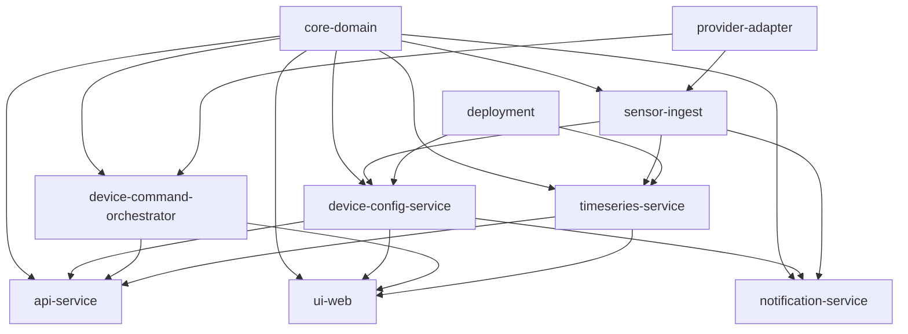

# Module Index

## Dependency Graph

## Circular Dependencies

None detected. The graph is a DAG with `core-domain` at the root.

## Module List

| Module | Domain | Status | Workstream | FR Coverage | Description |
|--------|--------|--------|------------|-------------|-------------|
| core-domain | core | pending | WS1 | Foundation | Device aggregate model, access-config union types, projection definitions |
| api-service | api | pending | WS2 | FR-1xx, FR-8xx endpoints | HTTP validation, routing, response serialization |
| sensor-ingest | hardware | pending | WS3 | FR-2xx | I2C/GPIO polling, BravePI decode, sensor data normalization |
| provider-adapter | hardware | pending | WS3 | FR-2xx, FR-6xx protocols | BravePI/BraveJIG serial protocol codecs, transport abstraction |
| device-command-orchestrator | orchestration | pending | WS4 | FR-6xx, FR-7xx | Command lifecycle, busy/timeout/retry, ACK handling |
| device-config-service | data | pending | WS1-2 | FR-1xx, FR-3xx (MariaDB) | Device CRUD, DTO assembly, read-model rebuild |
| timeseries-service | data | pending | WS5 | FR-3xx (InfluxDB), FR-4xx | InfluxDB read/write, query aggregation |
| notification-service | notification | pending | WS5 | FR-5xx | Threshold detection, MQTT/email dispatch |
| ui-web | ui | pending | WS6 | FR-4xx, FR-1xx screens | Dashboard, forms, realtime charts |
| ops-service | ops | pending | WS7 | FR-8xx, FR-403 | Time sync, reboot, camera, Swagger UI |
| deployment | deployment | pending | WS7-8 | FR-10xx | Docker, DB init/migration, system bootstrap |

## Legacy Source Mapping

| Module | Legacy Tab(s) / Files | Approx Node Count |
|--------|----------------------|-------------------|
| core-domain | Cross-cutting (Type2Config subflow, All Devices subflow) | — |
| api-service | PI・JIG・I2C・GPIO (HTTP nodes), .node-red/swagger/ | ~30 |
| sensor-ingest | PI・JIG・I2C・GPIO (decode, I2C, GPIO, Python scripts) | ~200 |
| provider-adapter | PI・JIG・I2C・GPIO (serial codecs, JSONデコード functions) | ~50 |
| device-command-orchestrator | ルーター, モジュール, BLEトランスミッター | ~240 |
| device-config-service | デバイス登録, Init Config subflow, All Devices subflow | ~130 |
| timeseries-service | センサーログ | ~66 |
| notification-service | 設定 (partial), Count Up route | ~60 |
| ui-web | ダッシュボード, デバイス登録 (UI parts), static/ | ~150 |
| ops-service | その他 | ~92 |
| deployment | docker/, init.sql | — |

## Design Defects to Address

| ID | Issue | Affected Modules |
|----|-------|-----------------|
| D3-1 | No persistence layer boundary | device-config-service, api-service |
| D3-2 | Protocol details leak across layers | provider-adapter, sensor-ingest, ui-web |
| D3-3 | Privileged OS ops in business process | ops-service |
| D4-1 | Multiple inconsistent cache shapes | device-config-service, sensor-ingest |
