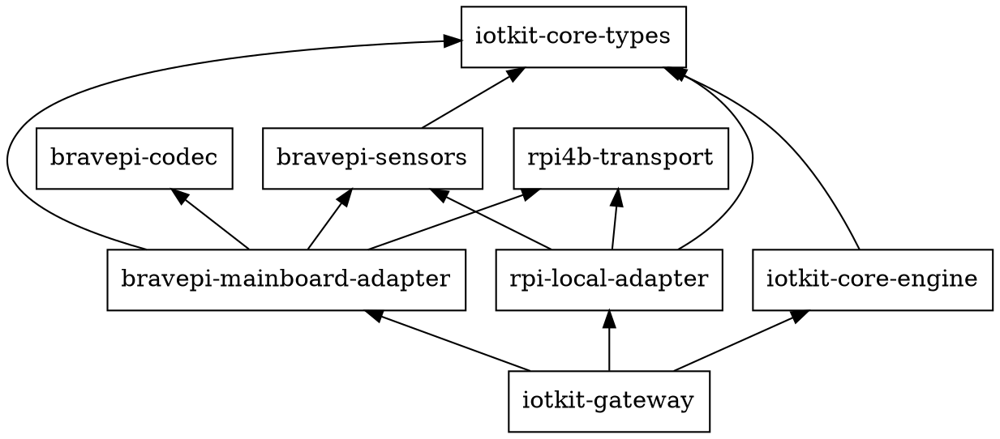

# Codex Review

## 2026-03-27 Core/Engine Direction

### 現状認識

- `core/types` には `AdapterEvent` / `AdapterCommand` / `DeviceKey` などの境界型がある
- `bravepi-adapter` は `event_tx` に `AdapterEvent` を流し、`command_rx` で `AdapterCommand` を受ける
- ただし `core/engine` はまだ存在せず、adapter の出力を集約して保持する層が空いている

### 方針

- 次の実装対象は `core/engine` とする
- `core/engine` は `core/types` のみに依存する独立 crate にする
- `core/engine` は adapter 非依存とし、`bravepi-adapter` の実装詳細を知らない
- app binary は composition root として adapter と engine を接続する

依存方向:

```text
core/types
  ↑
core/engine
  ↑
app binary
  ↑
bravepi-adapter
```

### core/engine v1 のスコープ

- `EngineEvent { adapter_id, event }` を受け取る ingest 境界
- in-memory device projection (`HashMap`)
- query API
- DB / MQTT / UI / adapter registry はスコープ外

### 複数 adapter 対応

- `core/engine` は最初から複数 adapter を扱う前提にする
- ただし engine 自体は単一 stream consumer に保つ
- 複数 adapter の `event_rx` の fan-in は app binary の責務にする

そのため、engine に渡す入力は `AdapterEvent` 単体ではなく、`adapter_id` を含む envelope にする:

```rust
pub struct EngineEvent {
    pub adapter_id: AdapterId,
    pub event: AdapterEvent,
}
```

### デバイス識別子

- engine 内での保存単位は `(AdapterId, DeviceKey)` 相当だが、tuple ではなく専用 struct にする
- 置き場所は `core/engine` crate 内でよい

```rust
pub struct EngineDeviceKey {
    pub adapter_id: AdapterId,
    pub device_key: DeviceKey,
}
```

理由:

- query API の戻り値として扱いやすい
- `Display` や logging を書きやすい
- tuple の取り違えを防げる

### v1 でやらないこと

- `AdapterCommand` の送信
- `command_tx` の保持
- adapter registry
- persistence
- device-command orchestrator

つまり `core/engine v1` は read-model only とする。

### 実装順

推奨順序:

1. hardening follow-up を片付ける
2. `core/engine` を最小スコープで作る
3. app binary で adapter と engine を接続する
4. その後に 2 つ目の adapter を追加し、重複を見て `adapter base` 抽出を判断する

## 2026-03-27 Core/Engine v1 API Shape

### query API の方針

- query API は actor-style の query channel ではなく direct method にする
- engine は内部に `RwLock<State>` を持ち、ingest 側が更新、query 側が snapshot を読む
- query は `devices()` / `device()` のようなメソッドで提供する
- command 送信や adapter registry は v1 の責務に含めない

### 推奨アプローチ

`core/engine v1` は Pure Library とする。

```rust
pub struct Engine {
    state: Arc<RwLock<State>>,
}

impl Engine {
    pub fn new() -> Self { ... }
    pub async fn apply(&self, event: EngineEvent) { ... }
    pub async fn devices(&self) -> Vec<DeviceView> { ... }
    pub async fn device(&self, key: &EngineDeviceKey) -> Option<DeviceView> { ... }
}
```

app binary が fan-in と ingest loop を持ち、engine は projection 更新と query のみを担当する。

### 却下した案

- Library + Ingest Helper
  - `run(rx)` helper を engine に持たせる案
  - v1 では app binary 側の loop が短く、engine に channel/shutdown 契約を増やす価値が薄い
- Actor Style
  - engine 自身が task と query channel を持つ案
  - read-model only の v1 に対して過剰で、query まで message passing にする必要がない

### この方針の意味

- engine は adapter 実装だけでなく Tokio task lifetime にも依存しすぎない
- テストは `Engine::new() -> apply() -> query()` で完結する
- 将来 command routing や adapter registry が必要になっても、その時点で別層として足せる

## 2026-03-27 Core/Engine Spec Review Notes

### implementation plan 前に直したい点

- `State = HashMap<EngineDeviceKey, DeviceView>` では不足
  - spec は同時に `discovered_at` / `last_seen` を内部保持する前提になっている
  - `DeviceView` から timestamp を外したので、内部状態は `DeviceState` を 1 段噛ませる方が自然

```rust
struct DeviceState {
    view: DeviceView,
    discovered_at: Instant,
    last_seen: Instant,
}

struct State {
    devices: HashMap<EngineDeviceKey, DeviceState>,
}
```

- `DeviceView.identity` は `Option<SensorIdentity>` ではなく必須でよい
  - `phantom device` を作らない前提なので、engine が保持する device は必ず `DeviceDiscovered` 済み
  - `AdapterEvent::DeviceDiscovered` は常に `identity` を持つ
  - `Option` にすると engine 利用側が不要な `None` 分岐を背負う

```rust
pub struct DeviceView {
    pub key: EngineDeviceKey,
    pub identity: SensorIdentity,
    pub last_reading: Option<SensorReading>,
    pub rssi: Option<i16>,
    pub battery_pct: Option<u8>,
    pub config: Option<DeviceConfigData>,
    pub last_error: Option<String>,
}
```

## 2026-03-27 Adapter Naming And Second Adapter Direction

### 先に確定してよい点

- 既存 `bravepi-adapter` は `bravepi-mainboard-adapter` に rename する方向で進めてよい
- これから追加する直結系 adapter は `local-direct-adapter` ではなく `rpi-local-adapter` とする
- board 固有性は adapter 名ではなく `rpi4b-transport` 側に残す

理由:

- `bravepi-adapter` だと BravePI 系全体の adapter に読めるが、実際の境界は「BravePI メインボードとの UART 接続」である
- `rpi-local-adapter` と対にすると、「BravePI メインボード経由」と「RPi ローカル直結」が名前だけで区別できる
- まだ個人開発段階で rename コストが低く、2つ目の adapter を足す前に揃えるのが最も安い

### 2つ目の adapter の方向

- `adapter base` 抽出判断のための 2 つ目の concrete adapter は、当面 `BraveJIG` ではなく `rpi-local-adapter` の v1 を対象にする
- `rpi-local-adapter` の設計境界は RPi 直結全般だが、v1 の実装スコープは I2C slice のみに絞る
- GPIO は同 adapter の後続 slice とし、v1 の base 抽出判断には持ち込まない

### rpi-local-adapter v1 の前提

- transport は `rpi4b-transport` の I2C を使う
- discovery は設定ベース + 起動時 probe とし、未発見 target は後続 poll で初回成功時に `DeviceDiscovered` を出す
- polling は adapter-level の共通 interval を 1 つだけ持つ
- sensor logic は既存 `bravepi-sensors` を shared sensor crate として流用する
- I2C の `probe_*` / `read_*` は adapter 内に置き、2 センサー分の実装後に抽出を判断する
- v1 の対象センサーは `MCP9600` と `OPT3001`
- `DeviceLost` は v1 では出さず、read 失敗は `AdapterError` に留める

### 依存関係の graphviz 例



### 内部アーキテクチャの推奨

- v1 は single-task polling loop を採る
- `AdapterHandle` 契約は既存 adapter と揃える
- internal orchestration は 1 本の loop に集約し、tick / command / shutdown を `tokio::select!` で扱う
- blocking I2C は sensor ごとの分散 task ではなく、1 poll cycle 単位でまとめて扱う
- UART のような `bytes_rx -> codec` 分離は I2C request/response では不自然なため持ち込まない

### 今の時点で追加で詰めなくてよいこと

- component breakdown の細部
- per-sensor descriptor の抽出形
- GPIO slice の内部監視方式

これらは `bravepi-mainboard-adapter` / `rpi-local-adapter` という命名と、上記の v1 前提を固定した後に詰めれば十分である。

## 2026-07-03 Wave 0 Plan 1 final impl review (PR #48)

実行: codex exec / gpt-5.5 / reasoning effort xhigh / read-only。対象: master...feature/wave0-plan1-ingest-core。

| 指摘 | 裁定 | 対処 |
|---|---|---|
| [高] ブリッジのno-ack経路がretry/spoolせずイベント消費 | 持ち越し(計画3) | D1軽量プロファイルとして契約内。正規解はiotkit-ingest-clientのspool+再送。plan末尾に記録 |
| [中] コレクタJoinHandle無監視(idle中の死) | 持ち越し | 次submit(~1s後)でfail-fast検知。実害軽微 |
| [中] マイグレーションのMAX水位方式で部分適用DBに穴 | 修正 | 集合差方式へ(fix(storage)) + ギャップ充填テスト |
| [中] 加速度: ドライバはg単位+派生magnitudeをブリッジが無変換でmG扱い | 修正 | ブリッジでg→mG(×1000)+派生値破棄(fix(gateway)) + テスト2本 |

良い判断として引用: 単一トランザクション+commit後ack、Rejected/no-ackの使い分け、マイグレーション合成。
教訓: 加速度単位はClaude系レビュー4層(タスク×2+最終+再)が全て見逃し、別ベンダーの実コード照合が捕捉した。
ドライバ出力単位とD6正準単位の対応表検証を計画3(写像移設)のレビュー観点に追加すること。
