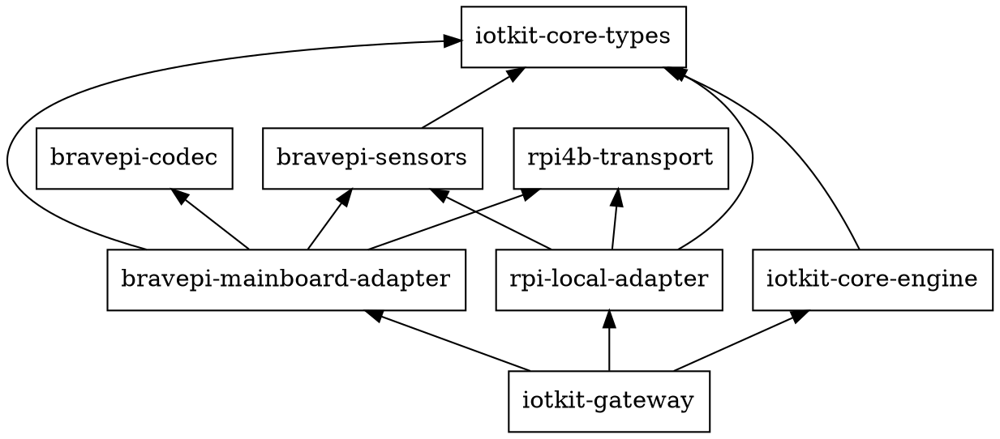

# Sub-project F: RPi Local Adapter v1 / Adapter Naming --- 設計 Spec

## 目的

adapter の命名境界を先に固定し、2 つ目の concrete adapter として
`rpi-local-adapter` v1 を追加する。

これにより:
- `bravepi-adapter` が実際には「BravePI メインボードとの UART 接続」を担う
  adapter であることを名前で明確化できる
- `rpi-local-adapter` を「RPi ローカル直結 hardware の管理境界」として追加できる
- 2 つ目の concrete adapter を I2C polling 型で実装し、後続の `adapter base`
  抽出判断に必要な比較材料を得られる
- `bravepi-sensors` を shared sensor crate として扱い始めるが、
  大きな抽出リファクタはまだ行わずに済む

## 設計判断

### Scope & Naming

この sub-project では 2 つの変更を同時に行う。

1. 既存 `bravepi-adapter` を `bravepi-mainboard-adapter` に rename する
2. 新規 `rpi-local-adapter` を追加する

rename の内容:
- crate / package 名を `bravepi-mainboard-adapter` に変更する
- workspace member path を更新する
- `iotkit-gateway` の依存先を更新する
- `AdapterId` は `bravepi-mainboard:{port_path}` に変更する
- `DeviceKey` prefix は `bravepi:` → `bravepi-mainboard:` に変更する
  - `convert.rs`, `event_loop.rs` の `format!("bravepi:{}:{}", ...)` を更新
  - まだ外部消費者がいないため breaking change のリスクはない

`rpi-local-adapter` v1 の境界:
- RPi に直結している local hardware 全体を表す adapter とする
- ただし v1 の実装スコープは I2C slice のみ
- GPIO slice は後続 sub-project に defer する
- `AdapterId` は `rpi-local:default` とする
  - `bus_path` は identity ではなく config / connection 情報に残す
  - 将来複数 instance が必要になったら `instance_name` を config に追加する

命名の意味:
- `bravepi-mainboard-adapter` は「BravePI メインボード経由」
- `rpi-local-adapter` は「RPi ローカル直結」
- board 固有性 (`RPi4B`) は adapter 名ではなく `rpi4b-transport` 側に残す

### 依存方向



補足:
- `bravepi-sensors` は shared sensor crate として両 adapter から使う
- ただし本 sub-project では workspace root への抽出は行わない
- `bravepi-sensors` の物理配置は rename 後の adapter tree 配下のままにする
- transitional coupling: `bravepi-sensors` は現時点で UART 固有の `UartSample` /
  `SensorHandler` / `decode_uart` を含む。`rpi-local-adapter` はこれらを使わず、
  I2C 向けの `from_i2c_raw` / `identity` / 定数のみを参照する。
  crate 分割は本 sub-project では行わない

### v1 スコープ

`rpi-local-adapter` v1 の対象:
- I2C のみ
- `MCP9600`
- `OPT3001`

v1 でやらないこと:
- GPIO slice
- per-sensor polling interval
- I2C bus scan
- `DeviceLost` 発行
- trait / base adapter 抽出
- per-sensor descriptor 抽出
- I2C mock/fake layer

### Config Model

`rpi-local-adapter` は設定ベースの discovery を採る。
起動時に「どの bus にどのセンサーがいる想定か」を受け取る。

```rust
pub struct RpiLocalConfig {
    pub bus_path: String,          // e.g. "/dev/i2c-1"
    pub poll_interval_ms: u64,     // adapter-level 共通 interval
    pub targets: Vec<SensorTarget>,
}

pub struct SensorTarget {
    pub address: u8,               // 7-bit I2C address
    pub kind: SensorKind,
}

pub enum SensorKind {
    MCP9600 {
        thermocouple_type: mcp9600::ThermocoupleType,
    },
    OPT3001,
}
// ThermocoupleType is re-exported from rpi-local-adapter so that
// gateway does not depend on bravepi-sensors directly.
```

config validation:
- `poll_interval_ms == 0` は reject する
- `bus_path` が空文字列なら reject する
- `address` は 7-bit I2C address 範囲 (`0x08..=0x77`) に限定する
- `targets` 内の `address` 重複は reject する
  - 同一 bus 上で同一 address に複数デバイスは物理的に不可能
- validation は `validate_config(&RpiLocalConfig) -> Result<(), String>` に分離する
- `start()` は config validation を runtime チェックより先に実行する

### AdapterId / DeviceKey

`rpi-local-adapter`:

```rust
AdapterId::new("rpi-local:default")
```

`rpi-local-adapter` の `DeviceKey` は adapter 内一意な logical sensor endpoint を表す。
key は `(address, sensor_ic_name)` から生成する。`thermocouple_type` などの
IC 固有パラメータは key に含めない（同一 address に同一 IC が物理的に 2 つ存在しないため）。

```rust
DeviceKey::new(format!("i2c:0x{:02x}:{}", address, sensor_ic_name(kind)))
```

`sensor_ic_name` は `SensorKind` の IC 名を返す:
- `SensorKind::MCP9600 { .. }` → `"mcp9600"`
- `SensorKind::OPT3001` → `"opt3001"`

例:
- `i2c:0x60:mcp9600`
- `i2c:0x44:opt3001`

設計ポイント:
- address と sensor IC 名の両方を含める
- `thermocouple_type` 等の IC 固有設定は key に含めない
- key 文字列は adapter 内一意であればよい
- core は key を parse しない
- `validate_config` の重複判定は `address` 単独で行う
  - 同一 bus 上で同一 address に異なる IC は物理的に共存できない

### Discovery Flow

discovery は「設定ベース + 起動時 probe」を採る。

```text
start()
  ↓
spawn polling_loop
  ↓
startup probe
  ├─ probe 成功 → DeviceDiscovered 送出、state = Active
  └─ probe 失敗 → state = Pending、warn log のみ
  ↓
periodic polling
  ├─ Active  → read → SensorData / AdapterError
  └─ Pending → probe → 成功なら DeviceDiscovered、state = Active（read は次 tick から）
```

ルール:
- `DeviceDiscovered` は 1 device につき 1 回だけ送出する
- 起動時に未発見の target は inventory に載せない
- Pending target は各 tick で再 probe する
- probe 成功時は DeviceDiscovered のみ送出し、first read は次の poll tick で行う
  - OPT3001 等の single-shot sensor は init 後に conversion latency があるため
- v1 では backoff を入れない
- `DeviceLost` は出さない

`start()` 自体の失敗条件:
- Tokio runtime 不在
- config validation 失敗

I2C bus の open / probe / read 失敗は `start()` の `Err` にはしない。
adapter task 起動後の `AdapterError` または warn log で扱う。

### Polling Loop

`rpi-local-adapter` の内部アーキテクチャは single-task polling loop を採る。

```rust
async fn polling_loop(
    config: RpiLocalConfig,
    event_tx: mpsc::Sender<AdapterEvent>,
    mut command_rx: mpsc::Receiver<AdapterCommand>,
)
```

loop の責務:
- startup probe の実行
- periodic poll の実行
- `TargetState` の保持
- `PollOutcome` から `AdapterEvent` を生成
- `Shutdown` 観測

`tokio::select!` の待ち対象:
- `interval.tick()`
- `command_rx.recv()`

interval の扱い:
- startup probe 直後の即時 tick を避けるため `interval_at(now + period, period)` を使う
- `command_rx.recv()` が `None` の場合も shutdown と同様に loop を抜ける

command の扱い:
- `AdapterCommand::Shutdown` → loop を抜ける
- `AdapterCommand::DeviceCommand(_)` → v1 では未対応。
  `AdapterEvent::AdapterError { device_key: Some(cmd.device_key), error }` で
  「unsupported command」を返す。silent drop はしない

### I2C Blocking I/O の扱い

`rpi4b-transport` の `I2cTransport` は address 付きで open する型であるため、
polling loop 自体は `I2cTransport` を保持しない。

代わりに:
- polling loop は `bus_path` と `targets` を保持する
- startup probe は 1 回の `spawn_blocking` で target 群を順に probe する
- poll cycle も 1 回の `spawn_blocking` で target 群を順に `probe/read` する
- `spawn_blocking` 内では target ごとに
  `I2cTransport::open(bus_path, I2cConfig { address })` して I/O を行い、drop する

v1 でこの単純方式を採る理由:
- 対象が 2 センサーのみ
- poll interval は秒単位で十分
- bus 専用 worker thread や transport pooling を入れる価値がまだ薄い

### TargetState

```rust
enum TargetState {
    Pending,
    Active(DeviceKey),
}
```

設計ポイント:
- `Pending` はまだ `DeviceDiscovered` を出していない target
- `Active(DeviceKey)` は discovery 済み target
- Active に `DeviceKey` を持たせ、event 生成時の再計算を避ける
- Active target の read 失敗では state を Pending に戻さない
  - v1 では `DeviceLost` を出さないため

### PollOutcome

blocking 区間から async 側へ返す結果は `PollOutcome` に正規化する。

```rust
enum PollOutcome {
    Discovered {
        target_index: usize,
        key: DeviceKey,
        identity: SensorIdentity,
    },
    Reading {
        key: DeviceKey,
        reading: SensorReading,
    },
    ReadError {
        key: DeviceKey,
        message: String,
    },
    ProbeFailed {
        target_index: usize,
        message: String,
    },
}
```

`spawn_blocking` の中では `event_tx.send()` しない。
代わりに `Vec<PollOutcome>` を返し、async 側が state 更新と event 送信を行う。

### Event Generation Rules

| 状況 | 送出する event |
|------|----------------|
| startup probe 成功 | `DeviceDiscovered { key, identity }` |
| Pending target の re-probe 成功 | `DeviceDiscovered { key, identity }` |
| read 成功 | `SensorData { key, reading }` |
| Active target の read 失敗 | `AdapterError { device_key: Some(key), error }` |
| Pending target の probe 失敗 | event なし、warn log のみ |
| transport / task 内の非 target-specific error | `AdapterError { device_key: None, error }` |

順序ルール:
- probe 成功時は `DeviceDiscovered` のみ送出し、first read は次の poll tick で行う
  - OPT3001 等の single-shot sensor は init 後に conversion latency があるため
- `event_tx` が closed の場合は loop を抜ける（`is_closed()` を loop 先頭でもチェック）

state 更新と event 生成は pure に近い関数へ分離する。

```rust
fn apply_outcomes(
    outcomes: Vec<PollOutcome>,
    states: &mut [TargetState],
    targets: &[SensorTarget],
) -> Vec<AdapterEvent>
```

### Sensor Integration

`bravepi-sensors` は shared sensor crate として扱う。
責務は pure decode と sensor facts に限定する。

`bravepi-sensors` が提供するもの:
- `SensorIdentity`
- `SensorReading`
- `identity(connection)`
- `from_i2c_raw(...)`
- sensor constants (`REG_*`, `DEVICE_ID`, `IC_PART_NUMBER`, など)

I/O は `rpi-local-adapter` 側に置く。

#### per-sensor 関数の置き方

v1 は 2 センサーのみなので、adapter 内に per-sensor の `probe_*` / `read_*`
関数を持つ。

```rust
fn probe(kind: &SensorKind, bus: &str, addr: u8) -> Result<SensorIdentity, String> {
    match kind {
        SensorKind::MCP9600 { thermocouple_type } => {
            probe_mcp9600(bus, addr, *thermocouple_type)
        }
        SensorKind::OPT3001 => probe_opt3001(bus, addr),
    }
}

fn read(kind: &SensorKind, bus: &str, addr: u8) -> Result<SensorReading, String> {
    match kind {
        SensorKind::MCP9600 { .. } => read_mcp9600(bus, addr),
        SensorKind::OPT3001 => read_opt3001(bus, addr),
    }
}
```

trait 化や descriptor 抽出は後続に defer する。

#### MCP9600

`probe_mcp9600`:
- `I2cTransport::open(bus, &I2cConfig { address: addr as u16 })`
- `mcp9600::REG_DEVICE_ID` を読む
- `mcp9600::DEVICE_ID` と照合する
- `mcp9600::REG_SENSOR_CONFIGURATION` に `mcp9600::config_value(thermocouple_type)` を書く
- `mcp9600::identity(connection_info)` を返す

`read_mcp9600`:
- `mcp9600::REG_HOT_JUNCTION` を 2 byte 読む
- `mcp9600::from_i2c_raw(&[u8; 2])` に渡す

#### OPT3001

`probe_opt3001`:
- `I2cTransport::open(bus, &I2cConfig { address: addr as u16 })`
- `opt3001::REG_DEVICE_ID` を読む
- `opt3001::DEVICE_ID` と照合する
- `opt3001::REG_CONFIG` に `opt3001::INIT_CONFIG` を書いて測定開始する
- `opt3001::identity(connection_info)` を返す

`read_opt3001`:
- `opt3001::REG_RESULT` を 2 byte 読む
- adapter 側で `u16` に正規化する
- `opt3001::from_i2c_raw(raw_u16)` に渡す

byte order の扱い:
- `rpi4b-transport` の `read_register` / `write_register` は生バイト列を返す（SMBus word ではない）
- OPT3001 の既存 parser (`opt3001::from_i2c_raw`) は SMBus `read_word_data` の
  byte-swapped word を前提にしている（legacy Python 実装と同じ）
- したがって adapter 側で `read_register` の 2 byte `[b0, b1]` を
  `u16::from_le_bytes([b0, b1])` として swapped word に正規化してから
  `opt3001::from_i2c_raw(raw_u16)` に渡す
- `write_register` も同様: `INIT_CONFIG.to_le_bytes()` を書く
- MCP9600 は生 big-endian なのでそのまま `&[u8; 2]` を渡す（swap 不要）
- write byte order は legacy Python (`opt3001.py` の `write_word_data(addr, REG_CONFIG, 0x10CC)`)
  に準拠する。SMBus `write_word_data` は LSB first なので `to_le_bytes()` と一致する。
  ただし legacy が正しい保証はないため、実装時に datasheet との突合を行う

### AdapterHandle Contract

公開 API は既存 adapter と同じ形に揃える。

```rust
pub struct AdapterHandle {
    pub id: AdapterId,
    pub event_rx: mpsc::Receiver<AdapterEvent>,
    pub command_tx: mpsc::Sender<AdapterCommand>,
    task_handle: Option<tokio::task::JoinHandle<()>>,
}

pub fn start(config: RpiLocalConfig) -> Result<AdapterHandle, std::io::Error> {
    let runtime_handle = tokio::runtime::Handle::try_current()
        .map_err(std::io::Error::other)?;

    validate_config(&config)
        .map_err(std::io::Error::other)?;

    let id = AdapterId::new("rpi-local:default");
    let (event_tx, event_rx) = mpsc::channel::<AdapterEvent>(256);
    let (command_tx, command_rx) = mpsc::channel::<AdapterCommand>(32);

    let task_handle = runtime_handle.spawn(
        polling_loop(config, event_tx, command_rx)
    );

    Ok(AdapterHandle {
        id,
        event_rx,
        command_tx,
        task_handle: Some(task_handle),
    })
}
```

対称性:

| 項目 | bravepi-mainboard-adapter | rpi-local-adapter |
|------|----------------------------|-------------------|
| `start()` 引数 | `port_path: String` | `config: RpiLocalConfig` |
| `AdapterId` | `bravepi-mainboard:{port_path}` | `rpi-local:default` |
| public fields | `id, event_rx, command_tx` | 同じ |
| 内部 task | `event_loop + reader thread` | `polling_loop` のみ |
| `shutdown()` | close rx → Shutdown → join loop → join thread | close rx → Shutdown → join task |

### Shutdown

```rust
impl AdapterHandle {
    pub async fn shutdown(mut self) -> Result<(), String> {
        self.event_rx.close();
        let _ = self.command_tx.send(AdapterCommand::Shutdown).await;
        if let Some(handle) = self.task_handle.take() {
            handle.await
                .map_err(|e| format!("polling_loop panicked: {}", e))?;
        }
        Ok(())
    }
}
```

設計ポイント:
- `event_rx.close()` で send 側の backpressure で詰まるのを防ぐ
- `Shutdown` を送って loop に協調停止を依頼する
- reader thread がないため shutdown は 3 段階で完結する
- 進行中の `spawn_blocking` が終わるまで shutdown は待つ
  - v1 では協調停止で十分とする
- 運用リスク: I2C bus または kernel driver が wedge した場合、`spawn_blocking` が
  返らず shutdown が無期限に待つ可能性がある。v1 では許容し、
  transport-level timeout の導入は後続 sub-project で検討する

### Gateway Integration

`iotkit-gateway` が adapter の起動と fan-in を担当する。
`core/engine` は adapter 実装を知らない。

```rust
let bravepi = bravepi_mainboard_adapter::start(port_path)?;
let rpi_local = rpi_local_adapter::start(config)?;

loop {
    tokio::select! {
        event = bravepi.event_rx.recv() => { /* ingest to engine */ }
        event = rpi_local.event_rx.recv() => { /* ingest to engine */ }
    }
}
```

adapter startup policy:
- `bravepi-mainboard-adapter` は required: start 失敗は fatal（既存動作を維持）
- `rpi-local-adapter` は opt-in: `RPI_LOCAL_ENABLED=1` 環境変数で有効化する
  - 有効時: start 失敗は fatal（config/runtime bug を見逃さないため）
  - 無効時（デフォルト）: adapter を起動しない
  - I2C センサー未接続のホストで永続的な probe 失敗 warn を避けるための措置

fan-in 終了条件:
- 片方の adapter の `event_rx` が `None`（channel closed）になっても、
  もう片方が生きている限り fan-in loop は継続する
- closed になった側の branch は `select!` から外す（fuse する）
- channel が closed になった adapter の handle は破棄せず保持し、
  shutdown 時に `shutdown()` を呼んで join/cleanup を実行する
- 全 adapter の channel が closed になったら fan-in loop を抜ける
- gateway の shutdown は全 adapter に `shutdown()` を呼んでから自身を終了する

理由:
- adapter は独立しており、一方の障害が他方に影響すべきでない
- v1 では adapter 間の依存関係がないため、この方針で十分

### Testing Strategy

#### テストの層

| 層 | 対象 | 実行環境 | I2C |
|----|------|----------|-----|
| unit | `bravepi-sensors` の `from_i2c_raw()` 等 pure decode | CI / dev | 不要 |
| unit | `apply_outcomes()` の状態遷移 | CI / dev | 不要 |
| unit | `validate_config()` | CI / dev | 不要 |
| integration | adapter の `probe_* / read_*` | RPi 実機 | 必要 |
| integration | `AdapterHandle` 起動 → event → shutdown | RPi 実機 | 必要 |

#### unit test の方針

I2C I/O の mock/fake layer は v1 では作らない。
代わりに pure な境界をテストする。

`bravepi-sensors`:
- `mcp9600::from_i2c_raw()`
- `opt3001::from_i2c_raw()`

`rpi-local-adapter`:
- `validate_config()`
- `apply_outcomes()`
- `start_without_runtime_returns_error()`

例:

```rust
#[test]
fn probe_success_emits_device_discovered() { ... }

#[test]
fn read_failure_keeps_active_state() { ... }

#[test]
fn zero_poll_interval_is_rejected() { ... }

#[test]
fn start_without_runtime_returns_error() { ... }
```

#### integration test の方針

実機 I2C を使う end-to-end test は `#[ignore]` 付きで持つ。

```rust
#[tokio::test]
#[ignore]
async fn real_i2c_discovers_and_reads_mcp9600() { ... }
```

確認すること:
- `start()` が成功する
- `DeviceDiscovered` が届く
- `SensorData` が届く
- `shutdown()` が正常終了する

## ファイル構成と変更範囲

### rename / modify

- `bravepi-adapter/` → `bravepi-mainboard-adapter/`
- `bravepi-adapter/Cargo.toml`
- `bravepi-adapter/poc/Cargo.toml`
- `bravepi-adapter/src/lib.rs`
- `bravepi-adapter/src/task/handle.rs`
- `bravepi-adapter/src/task/*` の import / crate path
- `iotkit-gateway/Cargo.toml`
- `iotkit-gateway/src/main.rs`
- workspace root `Cargo.toml`
- spec / plan / doc 内の crate 名参照

### add

- `rpi-local-adapter/Cargo.toml`
- `rpi-local-adapter/src/lib.rs`
- `rpi-local-adapter/src/config.rs`
- `rpi-local-adapter/src/task.rs` または `src/task/*`
- `rpi-local-adapter/src/sensors/mcp9600.rs`
- `rpi-local-adapter/src/sensors/opt3001.rs`
- `rpi-local-adapter/src/sensors/mod.rs`
- `rpi-local-adapter/src/*_test.rs`

### 変更しないもの

- `iotkit-core-types`
- `iotkit-core-engine`
- `rpi4b-transport` の public contract
- `bravepi-sensors` の workspace-root への抽出

### スコープ外

- GPIO input / output
- `DeviceLost` 発行
- adapter registry
- command routing for `rpi-local-adapter`
- bus 共有最適化 / long-lived I2C session
- 3 センサー目以降を含む descriptor / trait 抽出
