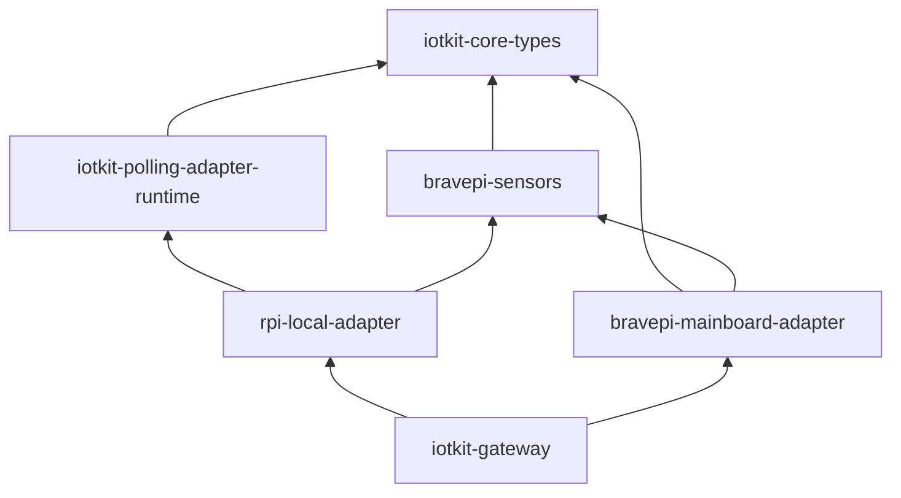

# I2C Polling Adapter Runtime Design Spec

> **Terminology:** This document uses "polling runtime" to refer to the `iotkit-polling-adapter-runtime` crate. The historical name "base adapter" may appear in git history and older discussions but is no longer canonical.

## 1. Purpose and Motivation

iotkit currently supports only Braveridge sensors. The goal of the polling runtime is to make it trivially easy for **AI agents** to create new adapters for I2C polling sensors on Raspberry Pi. The polling runtime serves as a "jig" (治具): AI reads the trait definition + documentation, implements sensor-specific logic only, and gets a working adapter with zero boilerplate.

**Key concern addressed:** Sensor IC decode logic (bytes → physical values) currently lives in `bravepi-sensors`. Transport-specific I/O (I2C probe/read) lives inside each adapter. Without the polling runtime, every new polling adapter must re-implement: channel wiring, polling loop, shutdown choreography, state machine, and event production. The polling runtime extracts these into a reusable module.

**Explicit scope boundary:** v1 is an **I2C polling** runtime only. It does not attempt to generalize across transports (UART, SPI, GPIO). If a second transport needs a polling runtime in the future, the common patterns can be extracted then — not prematurely.

### What changes and what doesn't

- **bravepi-mainboard-adapter** stays as-is. Its UART streaming architecture is fundamentally different from the polling model.
- **rpi-local-adapter** is refactored to use the polling runtime. It becomes a thin crate: config + `SensorDriver` implementations for MCP9600 and OPT3001.
- **bravepi-sensors** rename is **deferred**. The crate still contains BravePI-specific types (`UartSample`, `SensorHandler`). The rename happens in a future sub-project when a cleaner boundary emerges.
- **iotkit-gateway** changes minimally: rpi-local-adapter's public API (`start()` → `AdapterHandle`) stays the same.

## 2. Scope

### In scope

1. `iotkit-polling-adapter-runtime` crate (workspace-internal, not published): reusable I2C polling loop, AdapterHandle, channel wiring, shutdown, state machine, recovery logic
2. `SensorDriver` trait: the minimal interface an AI implements per I2C sensor
3. `PollingAdapterConfig` struct: I2C bus path, poll interval, sensor targets
4. Refactor rpi-local-adapter to use the polling runtime
5. Documentation for AI consumption (trait contract, examples, error expectations)

### Out of scope

- UART/streaming adapter runtime (bravepi-mainboard stays independent)
- Transport generalization beyond I2C
- bravepi-sensors rename (deferred)
- Gateway-level adapter registry / dynamic loading
- Config file parsing (TOML/YAML) — config remains programmatic
- New sensor implementations beyond MCP9600 and OPT3001
- Multi-endpoint sensors (one address producing multiple logical devices)
- DeviceCommand handling beyond rejection

### Design constraint: single-endpoint polling sensors

v1 targets sensors where one I2C address = one logical device = one `SensorReading` stream. This covers the vast majority of I2C sensor ICs. Multi-endpoint ICs are explicitly **not supported** in v1 — the duplicate-address validation will reject them. This constraint will be revisited when a concrete multi-endpoint sensor is needed.

### v1 operating envelope

- **Max recommended targets per adapter**: 8 (at ~5s probe wall-clock per stalled target, worst-case poll cycle = ~40s for 8 all-stalled probes)
- **Recommended poll interval**: ≥ 200ms per target for sensors requiring conversion latency; ≥ 1000ms for typical deployments
- If an actual poll cycle takes longer than `poll_interval_ms`, the polling runtime logs a warning at runtime (cycle overrun, soft limit, not fatal). `MissedTickBehavior::Skip` ensures overruns do not cause tick pileup.

## 3. SensorDriver Trait

The core abstraction. AI implements this per I2C sensor IC.

```rust
/// Trait for sensor-specific I2C probe and read logic.
/// The polling runtime calls these inside `spawn_blocking`.
///
/// Implementations MUST be `Send + Sync` (called from blocking threads).
/// All I/O errors MUST be returned as `Err(String)` with bus path and
/// address in the message for field debugging.
///
/// Drivers are per-target instances. Each SensorTargetConfig owns one
/// driver instance via Arc, which may hold per-sensor configuration (e.g.,
/// thermocouple type for MCP9600). Bus path and address are passed as
/// parameters because error messages need bus/addr context.
pub trait SensorDriver: Send + Sync {
    /// Probe the sensor: open I2C, verify device ID, write init config.
    /// Returns identity on success. Called for Pending targets each poll cycle.
    ///
    /// SHOULD complete within ~5s wall-clock time (advisory, not enforced
    /// by the runtime). Each I2C transaction has a ~1s kernel timeout, and
    /// a typical probe involves 2-4 transactions (open, device ID read,
    /// config write). The runtime cannot preempt a blocking ioctl; these
    /// bounds depend on kernel-level I2C timeouts.
    /// Drivers MUST NOT disable or extend kernel timeouts.
    /// If a driver needs longer init sequences, split across poll cycles.
    fn probe(&self, bus_path: &str, address: u8) -> Result<SensorIdentity, String>;

    /// Read the sensor: open I2C, read register(s), decode to SensorReading.
    /// Called for Active targets each poll cycle.
    ///
    /// SHOULD complete within ~3s wall-clock time (advisory, not enforced
    /// by the runtime). A typical read involves 1-2 I2C transactions.
    /// Same kernel-timeout dependency as `probe()`.
    fn read(&self, bus_path: &str, address: u8) -> Result<SensorReading, String>;

    /// IC name for DeviceKey generation (e.g., "mcp9600", "opt3001").
    /// Used as default key_suffix if SensorTargetConfig.key_suffix is None.
    fn ic_name(&self) -> &'static str;

    /// Optional: validate driver-specific constraints against the adapter
    /// config. Called during `validate_config()`. For example, OPT3001
    /// requires poll_interval_ms >= 200ms for conversion latency.
    /// Default implementation: always Ok.
    fn validate(&self, poll_interval_ms: u64) -> Result<(), String> {
        let _ = poll_interval_ms;
        Ok(())
    }
}
```

### Per-target driver instances

Each `SensorTargetConfig` owns a driver via `Arc<dyn SensorDriver>`. This allows:
- Per-sensor configuration inside the driver struct
- Cheap cloning into `spawn_blocking` closures (Arc clone, not deep clone)

```rust
struct Mcp9600Driver {
    thermocouple_type: ThermocoupleType,  // per-target config
}
impl SensorDriver for Mcp9600Driver { ... }

// In config construction:
SensorTargetConfig {
    address: 0x60,
    driver: Arc::new(Mcp9600Driver { thermocouple_type: ThermocoupleType::K }),
    key_suffix: None,
}
```

### Runtime ownership model

The polling loop stores targets as `Arc<Vec<TargetRuntime>>` where:
```rust
struct TargetRuntime {
    address: u8,
    driver: Arc<dyn SensorDriver>,
    key_suffix: String,  // resolved from config at startup
}
```

Each `spawn_blocking` call clones the `Arc<Vec<TargetRuntime>>` (cheap Arc bump). Driver trait objects are shared via Arc, never moved or deep-cloned. This is the same pattern used by tokio's own service layers.

### Why `String` errors (not a custom Error type)

Polling adapters surface I2C errors as `AdapterEvent::AdapterError { error: String }`. A typed error hierarchy would add complexity without benefit: the consumer (core engine) only logs the string. Driver implementations are responsible for including bus path and address context in their error messages (see learned perspective: every I2C error message must include bus/address for field debugging). The polling runtime adds bus/address context only for panic-caught errors, not for normal `Err(String)` returns from drivers.

## 4. PollingAdapterConfig

```rust
/// Config for an I2C polling adapter built on the polling runtime.
pub struct PollingAdapterConfig {
    /// I2C bus path (e.g., "/dev/i2c-1").
    pub bus_path: String,
    /// Polling interval in milliseconds. Must be > 0.
    pub poll_interval_ms: u64,
    /// Sensor targets to probe and poll.
    pub targets: Vec<SensorTargetConfig>,
}

/// A sensor target on the I2C bus.
pub struct SensorTargetConfig {
    /// 7-bit I2C address (0x08..=0x77).
    pub address: u8,
    /// The sensor driver that handles probe/read for this target.
    pub driver: Arc<dyn SensorDriver>,
    /// Stable suffix for DeviceKey generation. If None, uses driver.ic_name().
    /// Allows decoupling identity from driver naming.
    /// DeviceKey format: "i2c:0x{addr:02x}:{key_suffix}"
    pub key_suffix: Option<String>,
}
```

### Failure thresholds (internal constants, not config)

To avoid the partial-config anti-pattern, failure thresholds are internal constants in `iotkit-polling-adapter-runtime`, not public config fields:

- `MAX_READ_FAILURES: u32 = 5` — consecutive read failures before Active → Pending transition
- `MAX_PROBE_FAILURES: u32 = 10` — consecutive probe failures before escalation error

These become configurable only when an operator-facing config surface exists (sub-project C orchestrator). Until then, they are documented constants that the concrete adapter can override by forking or by a future API addition.

### Validation

`validate_config()` checks:
1. `bus_path` non-empty
2. `poll_interval_ms > 0`
3. Each address in valid 7-bit I2C range `0x08..=0x77` (excludes reserved addresses 0x00–0x07 and 0x78–0x7F; 10-bit addressing is not supported)
4. No duplicate addresses
5. Soft warning if `actual poll cycle duration > poll_interval_ms` (runtime warning when poll cycle takes longer than poll interval)
6. Call `driver.validate(poll_interval_ms)` for each target (driver-specific constraints)

The `validate()` hook on `SensorDriver` replaces the previous approach of putting per-sensor validation only in the concrete adapter crate. This keeps the validation in the polling runtime's `validate_config()` path so AI-generated adapters that call `start()` directly still get full validation.

### Bus validation at startup

`start()` attempts to open the I2C bus path as a file (read mode) once before spawning the polling loop:
- If the path does not exist or cannot be opened for reading → `start()` returns `Err` (fail fast)
- This catches: typos (`/dev/i2c-99`), missing device nodes, missing kernel modules
- **Guarantee scope:** "bus path exists and is readable as a file." This does NOT prove the file is a valid I2C bus device, nor that the process has the access mode the transport actually uses (e.g. read-write ioctl). Full I2C-level validation happens on the first probe, which uses the real transport driver (`rpi4b-driver`)
- The bus handle is not kept open; each probe/read opens its own handle (matching existing behavior)
- If the bus disappears after startup (hot-unplug), drivers surface errors via the normal probe/read failure path

## 5. Polling Loop (provided by polling runtime)

The polling runtime provides the entire async polling loop. This is the core value: new adapters get battle-tested polling behavior for free.

### State machine

Extended from current rpi-local-adapter with failure tracking:

```rust
enum TargetState {
    /// Not yet discovered. Tracks consecutive probe failures for escalation.
    Pending {
        consecutive_probe_failures: u32,
        /// Set to true after escalation error is emitted. Resets on success.
        escalation_emitted: bool,
    },
    /// Probe succeeded, actively reading.
    Active {
        key: DeviceKey,
        consecutive_read_failures: u32,
    },
}
```

### Recovery: Active → Pending on persistent read failure

When a target accumulates `MAX_READ_FAILURES` (default: 5) consecutive `ReadError` outcomes:
1. Emit `AdapterError` with the final I2C error (bus path + address)
2. Then emit `DeviceLost { device_key, reason }` where reason = `"consecutive read failures ({n}): {last_error}"`
3. The polling runtime logs this at `info` level for operator visibility
4. State transitions to `Pending { consecutive_probe_failures: 0, escalation_emitted: false }`
5. On the next poll cycle, the target is reprobed
6. If reprobe succeeds, `DeviceDiscovered` is emitted (new session)
7. Consecutive read failure counter resets on any successful read

**DeviceLost semantics in this context:** `DeviceLost` means "the adapter can no longer communicate with this device and will attempt reprobe." It does NOT mean the device is physically removed. The engine drops the device from its state on `DeviceLost`, which is intentional: the reprobe will re-emit `DeviceDiscovered` with fresh identity if the device recovers. This creates a clean break in the device session, which is the correct behavior for sensors that may need re-initialization after communication loss (e.g., OPT3001 needing config register rewrite).

The threshold of 5 (not 3) is chosen to tolerate transient bus glitches while still detecting genuine communication loss within a few poll cycles. Under normal conditions (1s polling, healthy bus), that's ~5 cycles before declaring loss. Under degraded conditions (stalled I2C calls), actual wall-clock time depends on cycle duration, which can stretch if targets are unresponsive.

Note: `DeviceLost` reason is available on the raw event stream only. Engine state does not persist the reason in v1.

### Poll cycle (spawn_blocking)

```
For each target:
  Pending → driver.probe(bus, addr)
    Ok(identity) → PollOutcome::Discovered (no same-cycle read)
    Err(msg) → PollOutcome::ProbeFailed (increment counter)
  Active(key) → driver.read(bus, addr)
    Ok(reading) → PollOutcome::Reading (resets failure counter)
    Err(msg) → PollOutcome::ReadError (increment counter)
```

### Event production (apply_outcomes)

Pure function: `Vec<PollOutcome>` × `&mut [TargetState]` → `Vec<AdapterEvent>`

- **Discovered** → `DeviceDiscovered` + state transition to `Active { consecutive_read_failures: 0 }`
- **Reading** → `SensorData` (rssi=None, battery_pct=None), reset failure counter
- **ReadError** → increment counter; if under threshold: `AdapterError` only; if at threshold: `AdapterError` + `DeviceLost` + transition to Pending
- **ProbeFailed** → increment counter; if at threshold and not yet escalated: emit `AdapterError` + set `escalation_emitted = true`; otherwise: log warning only

### Persistent probe failure escalation

When a Pending target hits `MAX_PROBE_FAILURES`:
- One `AdapterError` is emitted with `device_key: None` (the target has never been discovered, so no DeviceKey exists): `"target 0x{addr} probe failed {n} consecutive times: {last_error}"`
- `device_key: None` is intentional: the engine treats adapter-level errors as health signals, not per-device failures. Using `Some(key)` for an undiscovered target would be silently ignored by the engine's state machine.
- `escalation_emitted` is set to true — no further errors until target succeeds and resets
- This is one-shot-at-threshold, not repeated every cycle

### Channel send policy

**One rule for all branches:** every `event_tx.send(event).await` call checks `.is_err()`. If the channel is closed, the loop logs one warning and returns immediately. No branch uses `let _ = send()`.

For the shutdown-command send in `AdapterHandle::shutdown()`: best-effort `let _ = send()` is acceptable because shutdown already has a backup path (event_rx.close() forces the loop to exit on the next send attempt).

### Driver panic policy

If a `SensorDriver` method panics inside `poll_cycle`, the polling runtime catches it per-target using `catch_unwind(AssertUnwindSafe(...))`:
- The panicking target's outcome is treated as `ProbeFailed` or `ReadError` (depending on the current state), with the panic message and bus/address included
- For probe panics, an `AdapterError` is emitted **immediately** (bypasses the normal probe failure threshold)
- The adapter loop itself does **not** abort — other targets continue operating
- The same driver instance is reused on subsequent cycles

> **Panic safety contract:** `SensorDriver` implementations must be safe to call again after a panic. Stateless drivers (the common case) satisfy this trivially. Drivers with interior mutable state must ensure that state cannot be left inconsistent after an unwind.
>
> **Note for AI driver authors:** Always return `Err(String)` for expected failures. Panics indicate bugs, not I2C errors.

### Startup probe: partial failure behavior

When some (but not all) targets fail the startup probe, the runtime continues with the successful targets. Failed targets enter `Pending` state and are reprobed on subsequent cycles. Currently, per-target startup failures are logged but do **not** emit individual `AdapterError` events — only the all-fail case emits an immediate error. This is a known gap; a future improvement may emit per-target startup errors for better field diagnostics.

### Async loop

```
startup: open bus_path once to validate (fail fast on error)
startup probe (spawn_blocking)
if targets is non-empty AND ALL targets failed startup probe →
  emit one AdapterError immediately (don't wait MAX_PROBE_FAILURES
  cycles for a likely misconfiguration)
interval_at(now + period, period), MissedTickBehavior::Skip

loop {
    if event_tx.is_closed() { return }
    select! {
        cmd = command_rx.recv() => {
            Shutdown | None → return
            DeviceCommand(cmd) → send AdapterError {
                device_key: Some(cmd.device_key),
                error: "unsupported: I2C polling adapter v1 does not handle DeviceCommand"
            }
        }
        _ = interval.tick() => {
            spawn_blocking(poll_cycle)  // clones Arc<Vec<TargetRuntime>>
            apply_outcomes → send events (check each send)
        }
    }
}
```

### DeviceCommand handling

v1 contract: the polling runtime **always rejects** `DeviceCommand` with:
```rust
AdapterError {
    device_key: Some(cmd.device_key),  // preserve device attribution
    error: "unsupported: I2C polling adapter v1 does not handle DeviceCommand".to_string(),
}
```

This preserves per-device error attribution as expected by the core command boundary contract.

### DeviceKey generation

`"i2c:0x{addr:02x}:{suffix}"` where suffix = `target.key_suffix.clone().unwrap_or_else(|| driver.ic_name().to_string())`. Resolved at startup and stored in `TargetRuntime`.

### I2C bus stall mitigation

A single `spawn_blocking` call handles all targets serially. If one target's I2C call hangs, it blocks all other targets in that cycle.

Mitigation:
- The `rpi4b-driver` I2C transport uses kernel-level timeouts (default ~1s per I2C transaction on Linux)
- Worst-case cycle time = `target_count × probe_wall_clock_limit`. For the recommended max of 8 targets with all-stalled probes, that's ~40s
- Concurrent I2C operations on the same bus are serialized by the kernel anyway, so per-target `spawn_blocking` would not improve throughput
- If tighter timeout control is needed, drivers can implement timeouts inside `read()`/`probe()`

## 6. AdapterHandle and start()

The polling runtime provides a generic `start()` function:

```rust
/// Start an I2C polling adapter.
///
/// Validates config, opens bus path to verify access, checks for tokio
/// runtime, spawns the polling loop task, and returns an AdapterHandle.
///
/// Fails immediately if:
/// - Config is invalid (empty bus path, bad addresses, driver validation)
/// - Bus path cannot be opened as a file (missing path, permissions)
/// - No tokio runtime available
///
/// Note: file-open check does NOT validate that the path is a real I2C
/// bus device. Full I2C validation happens on the first probe cycle.
pub fn start(
    adapter_id: AdapterId,
    config: PollingAdapterConfig,
) -> Result<AdapterHandle, std::io::Error>
```

The returned `AdapterHandle`:
```rust
pub struct AdapterHandle {
    pub id: AdapterId,
    pub event_rx: mpsc::Receiver<AdapterEvent>,
    pub command_tx: mpsc::Sender<AdapterCommand>,
    task_handle: Option<JoinHandle<()>>,
}
```

Shutdown choreography:
1. `event_rx.close()` — prevents buffer-full deadlock
2. `let _ = command_tx.send(Shutdown)` — best-effort signal
3. `task_handle.await` — waits for polling loop (and any in-progress spawn_blocking) to finish

### Concrete adapter's start()

rpi-local-adapter's `start()` becomes a thin wrapper:

```rust
pub fn start(config: RpiLocalConfig) -> Result<AdapterHandle, std::io::Error> {
    let polling_config = to_polling_config(&config);
    iotkit_polling_adapter_runtime::start(AdapterId::new("rpi-local:default"), polling_config)
}
```

## 7. Refactored rpi-local-adapter

After refactoring:

```
rpi-local-adapter/
  src/
    lib.rs          — start() wrapper, RpiLocalConfig, validation, to_polling_config()
    drivers/
      mod.rs        — module declarations
      mcp9600.rs    — impl SensorDriver for Mcp9600Driver
      opt3001.rs    — impl SensorDriver for Opt3001Driver
  tests/
    integration.rs  — real I2C tests (unchanged)
```

**Removed from rpi-local-adapter** (moved to polling runtime):
- `polling_loop.rs` (entire file)
- `config.rs` core types (`SensorTarget`, `SensorKind` → replaced by `PollingAdapterConfig` + `SensorTargetConfig`)
- `AdapterHandle` struct and `shutdown()`
- `sensors/mod.rs` dispatch (replaced by trait dispatch)

**Kept in rpi-local-adapter:**
- `RpiLocalConfig` (rpi-local-specific: thermocouple type, OPT3001 min interval)
- `Mcp9600Driver` / `Opt3001Driver` (SensorDriver trait implementations)
- `to_polling_config()` conversion
- Integration tests

## 8. Gateway Impact

Minimal. The gateway calls `rpi_local_adapter::start()` which now returns `iotkit_polling_adapter_runtime::AdapterHandle`. The gateway accesses `.id`, `.event_rx`, `.command_tx` and calls `.shutdown()` — all present on the polling runtime's AdapterHandle.

rpi-local-adapter re-exports `AdapterHandle` from the polling runtime, so the gateway's import path doesn't need to change.

## 9. Testing Strategy

### Polling runtime unit tests

Migrated and extended from current rpi-local-adapter polling_loop.rs tests:

**apply_outcomes pure function tests:**
- Probe success → Discovered + Active
- Read success → SensorData, resets failure counter
- Read failure → AdapterError, stays Active, counter incremented
- Probe failure → no event (below threshold), stays Pending, counter incremented
- Discovery only (no same-cycle read)
- Multiple targets independent
- Consecutive read failures at threshold → AdapterError + DeviceLost + transition to Pending
- Successful read after failures resets counter
- Probe failure at threshold → one AdapterError emitted, escalation_emitted set
- Probe success after escalation → resets counter and flag

**Async polling loop tests with MockDriver:**
- Shutdown command stops loop
- Command channel drop stops loop
- Event channel close detected (with and without events)
- DeviceCommand rejection with device_key preserved
- Mock probe → discovery → read cycle
- Mock probe failure → retry on next tick → eventual success
- Mock consecutive read failures → DeviceLost → reprobe → rediscovery
- Persistent probe failure escalation (one-shot)
- Bus validation failure at start (returns Err)
- Empty targets: no startup probe error, no events, loop runs until shutdown
- All-targets-fail startup probe: immediate AdapterError emitted

### MockDriver for testing

```rust
struct MockDriver {
    ic_name: &'static str,
    probe_results: Mutex<VecDeque<Result<SensorIdentity, String>>>,
    read_results: Mutex<VecDeque<Result<SensorReading, String>>>,
}
```

VecDeque allows sequencing outcomes per call (fail-fail-succeed for recovery testing).

### rpi-local-adapter tests

- Config validation tests (adapted)
- Driver unit tests for Mcp9600Driver and Opt3001Driver
- Integration tests with real I2C hardware (`#[ignore]`, unchanged)
- Start-without-runtime test (adapted)

### bravepi-mainboard-adapter tests

Unchanged. No import path changes (rename deferred).

## 10. Crate Dependency Graph



`iotkit-polling-adapter-runtime` does NOT depend on `bravepi-sensors`. Sensor IC decode logic is referenced only by the concrete adapter (rpi-local-adapter).

## 11. AI Consumption: How to Add a New I2C Polling Sensor

An AI agent creating a new I2C sensor adapter follows these steps:

1. **Implement `SensorDriver`**: Write `probe()` and `read()` for the target IC. Reuse `bravepi_sensors::mcp9600` (or similar) for IC decode logic if the sensor IC is already supported. Otherwise, add a new module to `bravepi-sensors`.

2. **Create config**: Build a `PollingAdapterConfig` with sensor targets, each owning a driver instance via `Arc` with per-sensor config.

3. **Call `iotkit_polling_adapter_runtime::start()`**: Pass adapter ID and config.

4. **Done.** The polling runtime handles: channel wiring, polling loop, state machine, shutdown, event production, failure recovery.

Example for a hypothetical BME280 temperature/humidity sensor:

```rust
use iotkit_polling_adapter_runtime::{PollingAdapterConfig, SensorTargetConfig, SensorDriver, AdapterHandle};
use iotkit_core_types::{AdapterId, SensorIdentity, SensorReading};
use std::sync::Arc;

struct Bme280Driver {
    oversampling: u8,  // per-target config example
}

impl SensorDriver for Bme280Driver {
    fn probe(&self, bus: &str, addr: u8) -> Result<SensorIdentity, String> {
        // Open I2C, check chip ID, configure oversampling
        // Error messages MUST include bus and addr
    }
    fn read(&self, bus: &str, addr: u8) -> Result<SensorReading, String> {
        // Open I2C, read data registers, decode to physical values
    }
    fn ic_name(&self) -> &'static str { "bme280" }
}

pub fn start() -> Result<AdapterHandle, std::io::Error> {
    let config = PollingAdapterConfig {
        bus_path: "/dev/i2c-1".to_string(),
        poll_interval_ms: 2000,
        targets: vec![SensorTargetConfig {
            address: 0x76,
            driver: Arc::new(Bme280Driver { oversampling: 4 }),
            key_suffix: None,  // uses ic_name() = "bme280"
        }],
    };
    iotkit_polling_adapter_runtime::start(AdapterId::new("bme280:default"), config)
}
```

Total sensor-specific code: ~50 lines. Everything else is provided by the polling adapter runtime.

## 12. Adapter Taxonomy

All adapters share the gateway boundary contract: `AdapterEvent`, `AdapterCommand`, and the `AdapterHandle` shape that the gateway fans into the engine. What differs is the **runtime model** inside each adapter.

### Classification Axes

| Axis | Values | Meaning |
|------|--------|---------|
| `runtime_model` | `polling` \| `stream_ingress` | How the adapter acquires sensor data |
| `liveness_owner` | `adapter` \| `orchestrator` | Who decides a device is lost |
| `device_cardinality` | `single_endpoint` \| `multi_endpoint` | One I2C address = one logical device, or one transport = many logical devices |

> **Note on `liveness_owner`:** This is the *current* classification of each adapter, not a permanent architectural constraint. Future adapters may mix models (e.g., a polling adapter with orchestrator-owned liveness, or a streaming adapter with protocol-level heartbeats). When that happens, `liveness_owner` may become a runtime policy rather than a fixed axis.

### Current Adapters

| Adapter | runtime_model | liveness_owner | device_cardinality | Notes |
|---------|--------------|----------------|-------------------|-------|
| rpi-local-adapter | polling | adapter | single_endpoint | I2C register polling; emits `DeviceLost` after MAX_READ_FAILURES |
| bravepi-mainboard-adapter | stream_ingress | orchestrator | multi_endpoint | UART byte-stream/codec loop; discovers on first sensor frame; never infers loss from silence |

### Applicability Rule for `iotkit-polling-adapter-runtime`

Use the polling runtime **only when all four conditions hold**:
1. `runtime_model = polling` (adapter pulls data on a timer)
2. `device_cardinality = single_endpoint` (one I2C address = one logical device)
3. `liveness_owner = adapter` (the runtime hardcodes adapter-emitted `DeviceLost` on repeated read failure)
4. `DeviceCommand` handling = reject-only (v1 limitation)

If any condition does not hold, the adapter needs its own runtime (like bravepi-mainboard-adapter).

### Liveness Rule

**Only adapters with `liveness_owner = adapter` may emit `DeviceLost` based on transport/read failure.** Streaming adapters may emit transport errors (e.g. serial port disconnected), but silence-based device loss belongs in the orchestrator layer. The orchestrator's liveness mechanism (`uplink_interval_secs`, shared `last_seen` timestamps) is defined in sub-project C (orchestrator); this spec only constrains the adapter side of the boundary.

### Naming Convention

- `iotkit-polling-adapter-runtime`: the reusable runtime for polling-type adapters (this crate)
- Concrete polling adapters (e.g. `rpi-local-adapter`): thin wrappers that provide `SensorDriver` implementations
- Streaming adapters (e.g. `bravepi-mainboard-adapter`): self-contained, no shared runtime yet — extract a streaming base only when a second streaming adapter emerges
