# Phase 1A: Adapter Standalone — Design Spec

Date: 2026-03-29
Status: Draft
Issues: #40, #41, #42, #31

## Goal

rpi-local-adapter を独立バイナリとしてパッケージングし、I2C センサー読み取り → MQTT publish が end-to-end で動く状態にする。既存の gateway 組み込みモードは変更しない。

## Architecture

```
┌─────────────────────────────────────────────┐
│ iotkit-rpi-local (binary crate)             │
│                                             │
│  TOML config → rpi-local-adapter::start()   │
│                    │                        │
│                event_rx                     │
│                    │                        │
│           adapter-runner::run()             │
│              │            │                 │
│         envelope      MQTT client           │
│         conversion    (rumqttc)             │
│              │            │                 │
│         mqtt-contract  publish              │
└─────────────────────────────────────────────┘
        │
        ▼ MQTT
   Any broker (Mosquitto, AWS IoT, HiveMQ, etc.)
```

### Crate Structure

| Crate | Type | 責務 |
|-------|------|------|
| `core/mqtt-contract` | lib | MQTT topic schema + JSON envelope DTOs + AdapterEvent 変換 |
| `iotkit-adapter-runner` | lib | 共通 edge runtime: MQTT client, LWT, signal handling, event publish loop |
| `iotkit-rpi-local` | bin | rpi-local-adapter を standalone 実行する composition root |

依存関係: `iotkit-rpi-local` → `iotkit-adapter-runner` → `core/mqtt-contract` → `core/types`

既存 crate (`iotkit-polling-adapter-runtime`, `iotkit-gateway`) は変更しない。`rpi-local-adapter` は adapter_id を外部から受け取れるよう `start()` の signature を拡張する（後述）。`core/types` は `SensorReading.labels` を `Vec<&'static str>` → `Vec<String>` に変更する（MQTT decode で owned string が必要なため）。

## 1. MQTT Event Envelope (core/mqtt-contract)

### Topic Schema

```
iotkit/v1/{adapter_id}/telemetry     # SensorData readings
iotkit/v1/{adapter_id}/discovery     # DeviceDiscovered
iotkit/v1/{adapter_id}/loss          # DeviceLost
iotkit/v1/{adapter_id}/error         # AdapterError
iotkit/v1/{adapter_id}/status        # online/offline (retained, QoS 1)
iotkit/v1/{adapter_id}/inventory/{device_key}  # per-device discovery (retained)
```

`{adapter_id}` は MQTT topic-safe に percent-encoding でエスケープ（`:` → `%3A`, `/` → `%2F` 等）。可逆変換のため topic から元の adapter_id を復元可能。元の adapter_id は envelope 内にも保持。

### Envelope Format

全 envelope に共通ヘッダ:

```json
{
  "v": 1,
  "adapter_id": "rpi-local:default",
  "ts": 1711700000000
}
```

- `v`: envelope version。将来の互換性のため。consumer は未知の `v` を `DecodeError` として reject する。
- `ts`: envelope 生成時刻 (unix ms, non-negative)。telemetry の `ingested_at` とは別。decode 時に負値は `DecodeError` として reject する。

#### Telemetry

```json
{
  "v": 1,
  "adapter_id": "rpi-local:default",
  "ts": 1711700000000,
  "device_key": "i2c:0x60:mcp9600",
  "sensor_type": "temperature",
  "ingested_at": 1711700000000,
  "values": [25.3],
  "labels": ["temperature_c"],
  "rssi": null,
  "battery_pct": null
}
```

#### Discovery

```json
{
  "v": 1,
  "adapter_id": "rpi-local:default",
  "ts": 1711700000000,
  "device_key": "i2c:0x60:mcp9600",
  "identity": {
    "manufacturer": "Microchip",
    "ic_part_number": "MCP9600",
    "sensor_type": "temperature",
    "connection": {
      "kind": "i2c",
      "parameters": {"address": "0x60", "bus_path": "/dev/i2c-1"}
    }
  }
}
```

#### Loss

```json
{
  "v": 1,
  "adapter_id": "rpi-local:default",
  "ts": 1711700000000,
  "device_key": "i2c:0x60:mcp9600",
  "reason": "5 consecutive read failures"
}
```

#### Error

```json
{
  "v": 1,
  "adapter_id": "rpi-local:default",
  "ts": 1711700000000,
  "device_key": "i2c:0x60:mcp9600",
  "error": "I2C bus error: NACK"
}
```

`device_key` は null 可（adapter-level error の場合）。

#### Status (retained)

```json
{
  "v": 1,
  "adapter_id": "rpi-local:default",
  "ts": 1711700000000,
  "online": true
}
```

LWT payload: `{"v":1,"adapter_id":"rpi-local:default","ts":0,"online":false}` (`ts: 0` は LWT では設定時刻が不明なため)

#### Inventory Recovery

Discovery message は **retained** として per-device topic に publish する:
- Topic: `iotkit/v1/{adapter_id}/inventory/{device_key}` (percent-encoded)
- Payload: Discovery envelope と同一 JSON (retained, QoS 1)
- DeviceLost 時: 該当 device の inventory topic に empty retained message を publish（broker から削除）
- MQTT reconnect 時: adapter は全 active device の discovery を再 publish する

これにより、subscriber が後から接続しても retained message から全 active device の inventory を復元できる。通常の `discovery` topic は non-retained のイベント通知として残す（リアルタイム通知用）。

**Design Decision:** per-device retained topic を使う理由は、adapter が device 単位で inventory を更新・削除でき、subscriber が wildcard subscribe (`iotkit/v1/+/inventory/+`) で全 adapter の全 device を取得できるため。adapter-level の一括 inventory snapshot だと、1 device の追加/削除で全体を再 publish する必要がある。10 devices なら問題ないが、将来 100+ devices で不必要に大きい retained message になる。

### Design Decisions

**なぜ JSON か:** デバッグしやすい。MessagePack 等のバイナリフォーマットは throughput が問題になってから検討する。10 sensors × 1Hz = 10 msg/sec、JSON 1msg ≈ 200 bytes → 2KB/sec。Mosquitto のローカル throughput は 10,000+ msg/sec なので headroom 99.9%以上。

**なぜ QoS 1 か:** at-least-once delivery。QoS 0 はネットワーク不安定時にデータロスし、QoS 2 はオーバーヘッドが大きい。gateway 側で idempotent write（ON CONFLICT DO NOTHING）が既にあるため、重複配信は安全。

**なぜ adapter_id を topic に含めるか:** gateway が adapter 単位で subscribe/filter できる。wildcard subscribe (`iotkit/v1/+/telemetry`) で全 adapter を受信可能。

**Rejected: per-device topic for telemetry (`iotkit/v1/{adapter_id}/{device_key}/telemetry`):** topic 数が sensor 数に比例して増える。10 sensors なら問題ないが、将来 100+ sensors で broker の topic tree が膨張する。adapter 単位でまとめる方がスケーラブル。ただし inventory は per-device retained topic を使う（inventory recovery のため）。

**adapter_id の source of truth:** TOML config の `adapter_id` が唯一の source of truth。rpi-local-adapter の `start()` に `adapter_id` を渡せるよう signature を拡張する。既存の gateway 組み込みモードでは従来通り内部で生成する（backward compatible に optional parameter として追加）。

**Rejected: adapter handle から adapter_id を取得:** 現在の `start()` が内部で hardcode しているが、standalone 運用では config から制御可能にする必要がある。handle 内の ID と MQTT publish の ID が一致しないリスクを排除するため、config を single source of truth とする。

**encode/decode の対象 event:** v1 では `SensorData`, `DeviceDiscovered`, `DeviceLost`, `AdapterError` の 4 event type を encode/decode 対象とする。`DeviceConfig` は Phase 2 の command bridge (#46) で扱い、Phase 1A では encode 対象外と明記する。telemetry envelope には `labels` フィールドを含め、SensorReading の完全な round-trip を保証する。

### Public API

```rust
// core/mqtt-contract/src/lib.rs

/// Build MQTT topic string for a given event type
pub fn topic(adapter_id: &AdapterId, event_type: EventType) -> String;

/// Event types for topic routing
pub enum EventType {
    Telemetry,
    Discovery,
    Loss,
    Error,
    Status,
}

/// Convert AdapterEvent to MQTT envelope bytes (JSON)
pub fn encode_event(adapter_id: &AdapterId, event: &AdapterEvent) -> Result<(EventType, Vec<u8>), EncodeError>;

/// Decode MQTT envelope bytes back to AdapterEvent (for gateway subscriber)
pub fn decode_event(event_type: EventType, payload: &[u8]) -> Result<(AdapterId, AdapterEvent), DecodeError>;

/// Encode status message
pub fn encode_status(adapter_id: &AdapterId, online: bool) -> Vec<u8>;

/// Decode status message
pub fn decode_status(payload: &[u8]) -> Result<(AdapterId, bool), DecodeError>;
```

Dependencies: `core/types`, `serde`, `serde_json`.

## 2. Standalone Adapter Runner (iotkit-adapter-runner)

### Runner State Machine

```dot
digraph RunnerLifecycle {
  rankdir=LR;
  node [shape=box fontname="monospace"];
  edge [fontname="monospace" fontsize=10];

  start [shape=circle label="start"];
  validating [label="ValidatingConfig\nparse URL (structured parser)\nvalidate explicit --config\nvalidate TLS cross-fields\nderive stable client_id"];
  starting [label="Starting\nspawn adapter\nspawn publisher\nspawn eventloop\ninstall task supervision"];
  reconnecting [label="Reconnecting\nkeep desired_inventory\nkeep pending_retained_ops\nbuffer outbound events (bounded 1000)\ndo NOT retire ops on enqueue"];
  online [label="Online\nentered ONLY on ConnAck\nentry actions:\n1. publish retained online=true\n2. reconcile retained inventory\n3. replay pending tombstones\n4. replay buffered telemetry (fair)"];
  shutdown [label="Shutdown\n1. stop adapter (producer停止)\n2. drain pending ops (timeout 2s)\n3. publish retained online=false\n4. grace eventloop (2s)\n5. disconnect"];
  exit_ok [shape=doublecircle label="Exit 0"];
  exit_fail [shape=doublecircle label="Exit != 0"];

  start -> validating;
  validating -> exit_fail [label="invalid config"];
  validating -> starting [label="ok"];
  starting -> exit_fail [label="adapter/task spawn fail"];
  starting -> reconnecting [label="tasks running\n(initial state before first ConnAck)"];
  reconnecting -> reconnecting [label="AdapterEvent →\nupdate desired_inventory +\nbuffer telemetry"];
  reconnecting -> online [label="ConnAck"];
  online -> online [label="AdapterEvent →\nupdate desired_inventory +\npublish immediately"];
  online -> reconnecting [label="session lost"];
  online -> shutdown [label="SIGINT | SIGTERM |\ncritical task exit"];
  reconnecting -> shutdown [label="SIGINT | SIGTERM |\ncritical task exit"];
  shutdown -> exit_ok [label="signal + drain ok"];
  shutdown -> exit_fail [label="critical failure |\ndrain timeout"];
}
```



### Local State Model

Runner は以下の3つの独立した状態を管理する:

| State | 内容 | Disconnect 時 | ConnAck 時 |
|-------|------|-------------|-----------|
| `desired_inventory` | 現在 active な device の最新 discovery payload | 保持。DeviceDiscovered/DeviceLost で更新し続ける | 全件 retained publish で broker と reconcile |
| `pending_retained_ops` | broker に送達確認できていない retained upsert/tombstone | 保持。enqueue 成功では retire しない | 全件再送。session が変わったので前回の enqueue は無効 |
| `outbound_buffer` | telemetry/error の bounded deque (1000件) | buffer に追加。溢れたら oldest drop (warn!) | fair replay: 10件 flush → yield → 10件 flush... |

**重要:** `AsyncClient::publish().await` の Ok は「rumqttc 内部キューに入った」を意味し、「broker に届いた」ではない。したがって `pending_retained_ops` からの retire は ConnAck 後の reconcile 成功時のみ。

### Event Classes and Disconnect Policy

| Event class | 例 | Disconnect 時 | 理由 |
|-------------|---|-------------|------|
| Retained state ops | inventory upsert, tombstone, status | **MUST NOT drop。** desired_inventory + pending_retained_ops に記録 | broker 上の retained message と整合を取る必要がある |
| Lossy telemetry | SensorData, AdapterError | bounded buffer (1000件)。溢れたら oldest drop | 古い telemetry より最新値の方が価値が高い |

### Shutdown Sequence (ordered)

```
1. Stop adapter (producer 停止 → event_rx close)
2. Drain: publish_task が残りの outbound_buffer + pending_retained_ops を送信 (timeout 2s)
3. Publish retained online=false (with real timestamp, NOT ts=0)
4. Grace period: eventloop に 2s の flush 時間を与える
5. Disconnect → eventloop abort
6. Exit code: signal 起因 = 0, critical failure 起因 = non-zero
```

**LWT (Last Will) の `online=false` は `ts=0`**（設定時刻不明）。graceful shutdown の `online=false` は `now_ms()`。subscriber はこの差で crash vs clean shutdown を区別可能。

### Task Supervision

```
main task: signal 待ち + runner_handle + adapter 監視
  ├── tokio::spawn(eventloop_task)  ← EventLoop.poll() 無限ループ
  └── tokio::spawn(publish_task)    ← event_rx → encode → publish
```

**Critical task exit:** eventloop_task または publish_task が予期せず終了した場合、main は即座に Shutdown に遷移し、exit non-zero。main は `tokio::select!` で signal, runner_handle の両方を監視する。

**publish_task と eventloop_task は独立 tokio task。** `select!` で混ぜない。starvation 防止。

### Config

```rust
pub struct MqttConfig {
    pub broker_url: String,         // mqtt:// or mqtts://、url crate で parse
    pub client_id: Option<String>,  // None → "iotkit-<percent_encoded(adapter_id)>"（deterministic, reversible）
    pub keepalive_secs: Option<u32>, // default: 30
    pub ca_path: Option<PathBuf>,   // TLS CA cert
    pub client_cert_path: Option<PathBuf>,  // mTLS client cert (client_key_path と同時必須)
    pub client_key_path: Option<PathBuf>,   // mTLS client key (client_cert_path と同時必須)
}
```

### Config Validation Rules (cross-field)

- `broker_url`: `url` crate で parse。`mqtt://` or `mqtts://` のみ。IPv6 bracket notation 対応。
- `mqtt://` + TLS 設定 (ca_path, client_cert_path, client_key_path) → **error。** TLS は `mqtts://` 必須。
- `mqtts://` + ca_path なし → **error。**
- `client_cert_path` と `client_key_path` は同時に設定するか、両方なし。片方だけ → **error。**
- `client_id` 省略 → `iotkit-<percent_encoded(adapter_id)>`。deterministic、reversible、restart-stable。
- IPv6 host: `Url::host_str()` の bracket を strip してから rumqttc に渡す（rustls が bracket を reject するため）。

### Public API

```rust
pub async fn run(
    adapter_id: AdapterId,
    mqtt_config: MqttConfig,
    event_rx: mpsc::Receiver<AdapterEvent>,
) -> Result<(), RunnerError>;
```

Dependencies: `core/mqtt-contract`, `core/types`, `rumqttc`, `url`, `tokio`, `tracing`.

### Design Decisions

**なぜ bounded buffer (1000件) か:** RPi Zero 2W (512MB) で 10 sensors × 1Hz × 1000件 = 100s分 ≈ 200KB。OOM リスクなし。unbounded は長時間 disconnect で危険。local disk buffer は SD カード寿命に影響。

**なぜ exponential backoff with jitter か:** 複数 adapter が同時に reconnect すると broker に thundering herd。jitter で分散。初回 1s、最大 30s、jitter ±30%。

**なぜ fair replay か:** reconnect 後にバッファを一気に flush すると、live event の処理が止まる。10件 flush → yield → 10件 flush で interleave。

**Rejected: PUBACK tracking for retire:** rumqttc の PUBACK を個別メッセージに紐づけるのは複雑。v1 では ConnAck 単位の reconcile で十分。

### Required Automated Tests

- adapter task exit → runner が Shutdown に遷移し exit non-zero
- disconnect 中の DeviceDiscovered → desired_inventory に記録 → ConnAck 後に retained publish
- disconnect 中の DeviceLost → tombstone 記録 → ConnAck 後に empty retained publish
- ConnAck → 全 inventory republish
- graceful shutdown → adapter 停止 → drain → offline publish → exit 0
- explicit --config bad path → error exit
- half-configured TLS (cert without key) → error exit
- TLS settings on mqtt:// → error exit
- IPv6 broker URL → host bracket strip
- deterministic client_id → percent_encoded(adapter_id)
- negative timestamp in envelope → DecodeError

## 3. rpi-local Standalone Binary (iotkit-rpi-local)

### Config (TOML)

```toml
adapter_id = "rpi-local:default"

[mqtt]
broker_url = "mqtt://localhost:1883"
# client_id = "iotkit-rpi-local-01"  # optional
# keepalive_secs = 30
# ca_path = "/etc/iotkit/certs/ca.pem"
# client_cert_path = "/etc/iotkit/certs/client.pem"
# client_key_path = "/etc/iotkit/certs/client.key"

[adapter]
bus_path = "/dev/i2c-1"
poll_interval_ms = 1000

[[adapter.targets]]
driver = "mcp9600"
address = 0x60
thermocouple_type = "K"

[[adapter.targets]]
driver = "opt3001"
address = 0x44
```

### Binary Entrypoint

```rust
// iotkit-rpi-local/src/main.rs (pseudo)
fn main() {
    // 1. Init tracing
    // 2. Parse CLI args (--config path)
    // 3. Load + validate TOML config
    // 4. Build RpiLocalConfig from adapter section
    // 5. Validate adapter config (rpi_local_adapter::validate)
    // 6. Create tokio runtime
    // 7. rt.block_on(async {
    //      Start adapter (rpi_local_adapter::start) → Handle with event_rx
    //      Run adapter_runner::run(adapter_id, mqtt_config, event_rx)
    //    })
    // 8. On return: shutdown adapter handle
}
// Note: rpi_local_adapter::start() requires a live tokio runtime,
// so runtime creation MUST precede adapter start.
```

### Config Validation

- `adapter_id`: non-empty
- `mqtt.*`: MqttConfig cross-field validation に委譲（Section 2 参照）
- `adapter.*`: `rpi_local_adapter::validate()` に委譲
- `adapter.targets[].thermocouple_type` (MCP9600): **必須フィールド**。省略は parse error。不正な値は validation error。サイレント K fallback 禁止。
- `--config` パス: 明示指定の場合、ファイルが存在しなければ即 error exit。デフォルトパス (`./iotkit-rpi-local.toml` → `/etc/iotkit/iotkit-rpi-local.toml`) の fallback は `--config` 省略時のみ。

### Exit Code Contract

- Config validation failure → exit 1
- Adapter start failure → exit 1
- Runner early failure (MQTT connect 等) → exit 1（main が runner_handle を select! で監視）
- Signal (SIGINT/SIGTERM) + clean shutdown → exit 0
- Critical task unexpected exit → exit 1

### CLI

```
iotkit-rpi-local --config /path/to/config.toml
iotkit-rpi-local --help
iotkit-rpi-local --version
```

`--config` のデフォルト: `./iotkit-rpi-local.toml` → `/etc/iotkit/iotkit-rpi-local.toml`

Dependencies: `iotkit-adapter-runner`, `rpi-local-adapter`, `toml`, `clap`, `tracing`, `tracing-subscriber`, `tokio`.

## 4. Deploy (#31)

### Directory Layout

```
/opt/iotkit/
├── bin/iotkit-rpi-local
├── etc/
│   ├── iotkit-rpi-local.toml
│   └── certs/                    # optional TLS certs
└── data/                         # future local storage
```

### systemd Unit

```ini
[Unit]
Description=iotkit rpi-local I2C sensor adapter
After=network-online.target
Wants=network-online.target

[Service]
Type=simple
ExecStart=/opt/iotkit/bin/iotkit-rpi-local --config /opt/iotkit/etc/iotkit-rpi-local.toml
Restart=on-failure
RestartSec=5
User=iotkit
Group=iotkit
WorkingDirectory=/opt/iotkit/data
StandardOutput=journal
StandardError=journal

# Security hardening
ProtectSystem=strict
ReadWritePaths=/opt/iotkit/data
NoNewPrivileges=true
ProtectHome=true

# I2C access
SupplementaryGroups=i2c

[Install]
WantedBy=multi-user.target
```

### Design Decisions

**なぜ `User=iotkit` か:** root で動かすとセキュリティリスク。`iotkit` ユーザーを作成し、`i2c` グループに追加して I2C bus アクセスを許可。

**なぜ `network-online.target` か:** MQTT broker 接続が必要。WiFi 接続完了を待つ。adapter runner の reconnect で最終的にはつながるが、不要な reconnect ログを減らせる。

## 5. Test Strategy

### mqtt-contract
- serde round-trip: encode → decode → assert equality (全 event type)
- topic builder: adapter_id のエスケープ、各 event type の topic 生成
- unknown version handling: `v: 99` の envelope → DecodeError

### adapter-runner
- unit test: event_rx → envelope 変換の正しさ
- integration test: rumqttc の test broker は外部依存が必要なため、MQTT client は trait behind で mock 可能にする。ただし v1 では concrete rumqttc で実装し、mock は後回し。
- signal handling: テスト困難。手動テスト手順を README に記載。

### rpi-local binary
- config parse: valid TOML → RpiLocalStandaloneConfig
- config validation: invalid cases (empty broker_url, missing bus_path, etc.)
- adapter validation: 既存の `rpi_local_adapter::validate()` に委譲

### end-to-end (手動)
1. `mosquitto -c /dev/null -v` でローカル broker 起動
2. `mosquitto_sub -t 'iotkit/v1/#' -v` で subscribe
3. `iotkit-rpi-local --config example.toml` で adapter 起動
4. telemetry/discovery/status メッセージが受信されることを確認
5. Ctrl+C → offline status が publish されることを確認

## 6. Quantitative Targets

| Metric | Target | Rationale |
|--------|--------|-----------|
| MQTT publish latency (local broker) | < 5ms per message | rumqttc async publish、ローカル loopback |
| Memory footprint (rpi-local binary) | < 20MB RSS | RPi Zero 2W の 512MB の 4% 以下 |
| Startup to first publish | < 3s | adapter detect + init + first read + MQTT connect |
| Reconnect backoff range | 1s → 30s | exponential with ±30% jitter |
| Event throughput | 100 msg/sec sustainable | 10× headroom over 10 sensors × 1Hz |

## 7. Out of Scope

- Gateway MQTT subscriber (#45) — Phase 2
- DeviceKey bus identity change (#33) — Phase 2。現行の `i2c:0x{addr}:{suffix}` フォーマットのまま
- Transform layer (#43, #44) — Phase 1B
- BravePI standalone adapter (#46) — Phase 2
- Local disk buffer for MQTT disconnect — 将来検討
- MQTT v5 features — v1 は MQTT v3.1.1
- Auto-detection (#35) — Phase 2
